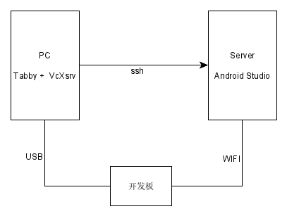

## 1. 背景

前一段时间使用rclone+[Android Studio][as]来[阅读Android框架代码](read-android-framework-code.md)的，现在遇到了一个新问题，如果我要调试Android框架代码，怎么办呢？

## 2. 环境

先说一下开发环境，因为PC配置一般，Android源代码都是放到几台服务器上的，平时工作都是使用ssh直接在服务器上开发、编译，所以限制了调试工作也只能在服务器上进行，我这里使用的方案是：



* 在服务器上安装最新版[Android Studio][as]，要支持Android11的Pair Using WI-FI功能
* 使用带X11-forwards功能的ssh终端，将界面投放本地PC上，我这里使用提[tabby][tabby]+[VcXsrv][vcxsrv]
* 在服务器上安装WIFI网卡，用于连接开发板，开发板上的系统是Android11以上

## 3. 调试过程 

* 按照[阅读Android框架代码](read-android-framework-code.md)配置好Android framework项目

* 运行[VcXsrv][vcxsrv]

* 使用[tabby][tabby]连接服务器，运行[Android Studio][as] 打开Android项目

  ```shell
  // 假设Android studio安装在~/download下
  cd ~/download/android-studio
  bin/studio.sh
  ```

* **通过WIFI连接开发板(关键)**

  * 开发板与服务器在同个WIFI网络

  * 开发板需要连接到WIFI并且启用**开发者选项**-->**无线调试**

  * 开发板启用root权限

    ```shell
    // PC机上执行，通过USB线连接设备
    adb root 
    adb remount
    ```

  * 打开[Android Studio][as]中的 **设备管理器**-->"Pair Using WI-FI" 向导

  * 如果网络比较复杂，[Android Studio][as]扫描可能需要一段时间，可以使用如下命令快速建立连接

    ```shell
    //以下代码在服务器上执行
    adb pair ip:port  
    //其中ip是开发板IP地址,port是端口号，可以在开发板的**开发者选项**-->**无线调试**-->使用配对码配对设备对话框中找到
    adb connect ip
    ```

* [Android Studio][as]调试

  剩下的事情就比较简单了，[Android Studio][as]里设置断点，使用 **Attach Debugger to Android Process**附加到开发板上某个进程上，就可以调试了。
  
  


## 4. 总结

如果PC配置强劲，就用不这么复杂了，直接在PC就可以调试了，这也是没有办法的事，转了几个弯，不过好在可以完成工作。


[tabby]:https://github.com/Eugeny/tabby
[vcxsrv]:https://sourceforge.net/projects/vcxsrv/
[as]:https://developer.android.com/studio
